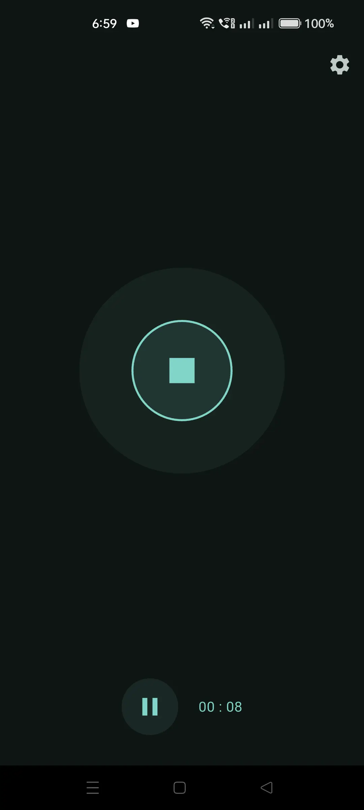
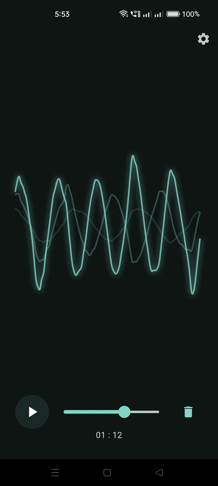
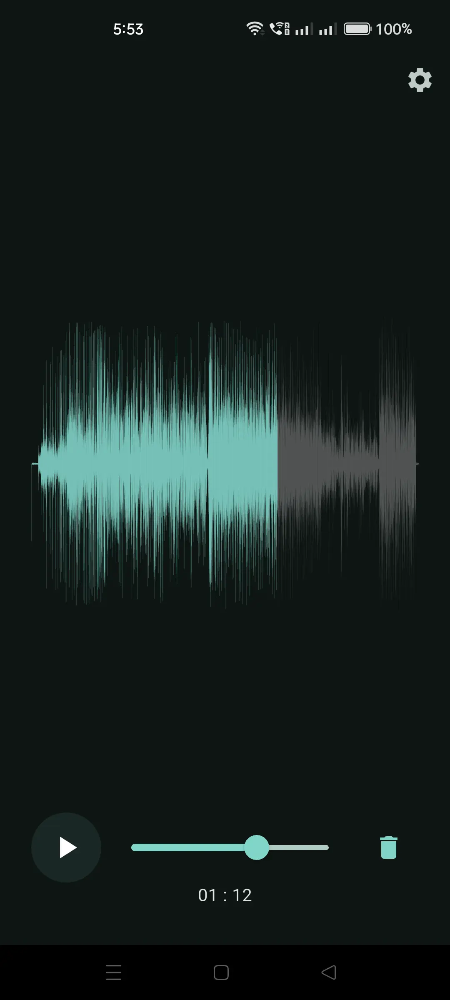
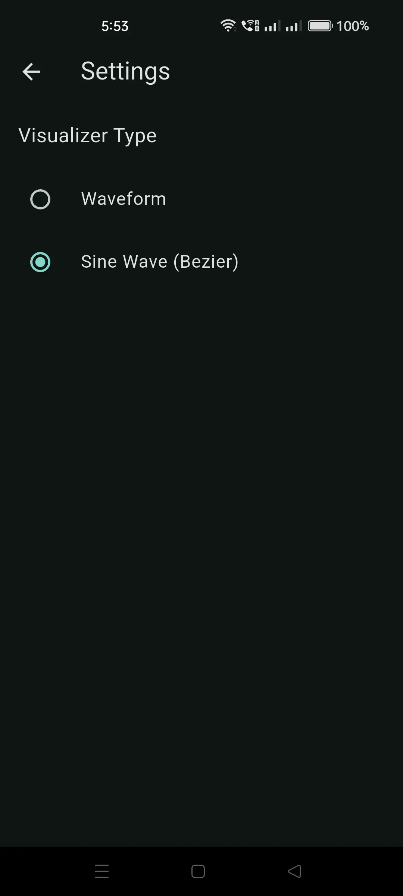

# 🎙️ Voice Recorder

---

A clean, minimal voice recording app built with Flutter. Designed to be lightweight and reliable, with a smooth and visually engaging UI. Ideal for quick audio capture, journaling, or voice notes.

---

## ✨ Features

- 🎚️ High-quality audio recording (Android & iOS)
- 🔊 Playback with animated waveform or sine wave visualizer
- 🕒 Recording duration display
- 📁 Local file storage (no internet required)
- ⚡ Snappy, responsive UI

---

## 🔧 Built With

- [`flutter`](https://flutter.dev)
- [`audioplayers`](https://pub.dev/packages/audioplayers)
- [`record`](https://pub.dev/packages/record)
- [`just_waveform`](https://pub.dev/packages/just_waveform)
- `CustomPainter`, `Ticker`, `Provider` – for animation and state management

---

## 🧪 Visualizer Customization

Users can choose between:

- `Waveform` – vertical bars based on preprocessed `.wav` amplitude data
- `Sine Wave` – animated flowing curves based on real-time playback

Switch visualizer in **Settings → Visualizer Type**

---

## 🧭 Roadmap

* [ ] Rename / delete recordings
* [ ] Share recordings to other apps
* [ ] Cloud backup (e.g., Firebase, GDrive)
* [ ] Transcription (via Whisper or Speech-to-Text)
* [ ] Real-time waveform during *recording*
* [ ] Tag-based voice journaling mode

---

## 🤝 Contributions

Open to PRs or feature discussions — especially around:

* Audio waveform improvements
* Real-time visualization techniques
* Better UX flows for recording/playback

---

## 📜 License

MIT — use it freely, or fork it and make it your own.
